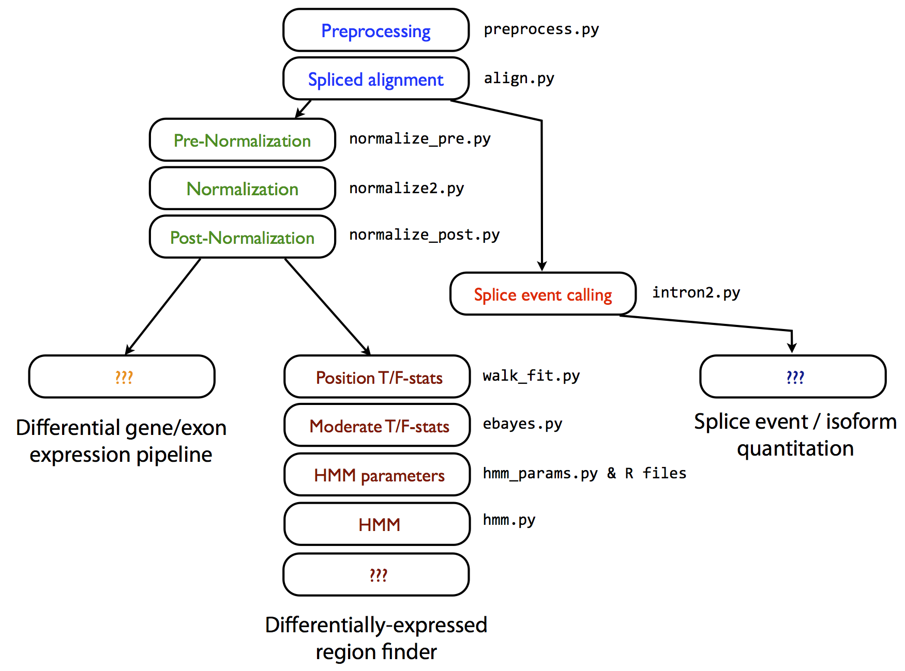

Rail
====
This is the source repository for the Rail-*, which currently includes just the Rail-RNA spliced alignment pipeline.

Install
-----
Start with a recent (>= 2009) Mac OS or Linux box. Download [`installers/rail-rna-1.0.0`](https://github.com/buci/rail/blob/master/installers/rail-rna-1.0.0_installer?raw=true), change to the directory containing it, and run
```
sudo ./rail-rna-1.0.0
```
to install for all users or
```
./rail-rna-1.0.0
```
to install for just you. Check
```
./rail-rna-1.0.0 -h
```
for more installation options. If the executable doesn't work, you may need [Python](http://www.python.org).

Design
------

Here's a flowchart showing how all the pipeline stages relate to each other,
and which source file each is implemented in.  The source files referred to
are in the `src/rail-rna` subdirectory.  More detailed descriptions of the
input and output tuples for each step can be found in the source file
headers.



Important outputs include:
* `bigBed` (`.bb`) files with per-sample coverage, output by `normalize2.py`
* A `.tsv` file with per-sample normalization factors output by
  `post_normalize.py`
* Some yet-to-be determined format for expressing splicing events, including
  splicing events that co-occurred on one sequencing fragment, output by
  `intron2.py`

Repository layout
-----------------

* `src`: All sources, including Python, R and C
* `data`: Manifest files describing big datasets and some scripts for running
  them through this pipeline as well as Myrna
* `doc`: Documentation
* `emr`: Scripts related to EMR mode
* `example`: Some examples of how to run the pipeline
* `hadoop`: Source related to the modes that use Hadoop
* `lib`: Required Java libraries
* `old`: Deprecated code from pre-Fall-2013
* `package`: Scripts for packaging up the tool and reference archives
* `tools`: Scripts for building some helpful tools

Rail-RNA
========

Summarizing RNA-seq data
------------------------

Keeping intermediate and final results as small as possible is a prime goal of
scalable software.  When intermediate results are large, a disproportionate
amount of effort is spent transferring and aggregating data mid-computation.
When final results are large, the user uses too much disk space, memory and
time to view, analyze and interact with the results.  Rail-RNA implements some
novel ideas regarding how to summarize large collections of RNA sequencing
data into concise, queryable data objects with the goal of maximizing
scalability and usability.

RNA sequencing data users might be concerned with questions such as:
1. What is the level of expression for each gene in each sample?
2. What splice junctions are used?
3. What isoforms are present?
4. In what abundance is each isoform present?
5. What does the data tell us about DNA sequence variation in the
   subject genomes?

These differ in what *aspect* of the input data is being examined. (1) is
concerned with how many alignments overlap certain genes, whereas (5) is
concerned with the nucleotide content of the sequencing reads. The questions
also differ in the degree to which the data is summarized.  For instance, (a)
is concerned only with summarized gene-level measurements, while (d) is
concerned with specific isoform-level measurements.

Rail-RNA uses a tiered strategy for handling queries over large collections of
RNA sequencing datasets while minimizing the data that must be preserved to
answer queries.  We categorize queries as belonging to tiers 1, 2 or 3
according to the required input data.  Tier-1 queries are concerned with (a)
nucleotide content of the sequence reads, and (b) how the reads align to the
genome (perhaps in a spliced fashion).  To answer a tier-1 query, we must
preserve information about the input reads and how they align to the genome,
e.g. in a spliced BAM file as output by TopHat.  Query (e) above is a tier-1
query.

Tier-2 queries are concerned with (a) depth of coverage within exons, and (b)
the number of times each observed splicing event occurs, including information
about how often combinations of splicing events co-occur.  For tier-2 queries,
we can avoid storing information about individual reads or alignments.
Rather, the data required to answer tier-2 queries could be summarized with,
e.g. a small bigBed file summarizing exon coverage, together with a sparse
tensor (equivalently: a weighted, ordered hypergraph) summarizing frequencies
and co-occurrences of splicing events.  Queries (b), (c) and (d) are tier-2
queries, and we expect that many other typical queries are also in tier 2.  We
expect, for instance, that all of the most relevant analyses performed by
tools such as Cufflinks and RSEM are in this tier.

Tier-3 queries require less information still; these are concerned only with
depth of coverage within exons.  This is generally sufficient for analyses
that are concerned with gene expression levels and differential gene
expression such as query (a) above.  Analyses performed by tools such as DEseq
and Myrna are in this tier.

TODO list
---------

* Carefully audit the code in `src/rail-rna/align.py` and add a comprehensive
  suite of unit tests.
* Move this TODO list to GitHub issue tracker

Running the drosophila example
------------------------------

Tool prerequisites:
* [Python]
* [SWIG]
* [Bowtie]
* [bedToBigBed]

[Python]: http://www.python.org
[SWIG]: http://www.swig.org
[Bowtie]: http://bowtie-bio.sourceforge.net/index.shtml
[bedToBigBed]: http://hgdownload.cse.ucsc.edu/admin/exe/

Data prerequisites:
* Expanded dm3 [iGenomes] tarball somewhere on your machine

[iGenomes]: http://support.illumina.com/sequencing/sequencing_software/igenome.ilmn

Configuration:
* Set `RAIL_HOME` environment variable to point to base of this checkout
* Set `IGENOMES_HOME` environment variable to point to directory that has
  `Drosophila_melanogaster` from iGenomes tarball as a subdirectory

To prepare for the test:

    cd $RAIL_HOME
    make -C src
    cd example/dmel_flux
    make
    (alternately, do "make -jN" where N = number of cores you can spare)

That last make command will take a while.  Among other things, it calls Flux
Simulator to simulate some RNA-seq reads.  To run the test do the following
from `$RAIL_HOME/example/dmel_flux`):

    sh local.sh

Contributors
------------

* [Ben Langmead]
* Jamie Morton
* Abhi Nellore
* [Jeff Leek]
* [Alyssa Frazee]

[Ben Langmead]: http://www.cs.jhu.edu/~langmea/index.shtml
[Jeff Leek]: http://www.biostat.jhsph.edu/~jleek/
[Alyssa Frazee]: http://alyssafrazee.com
